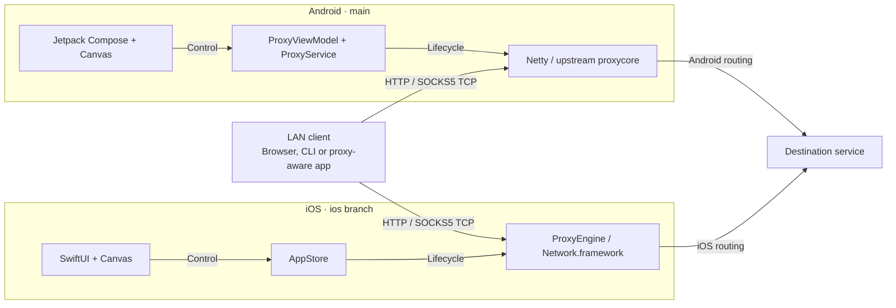
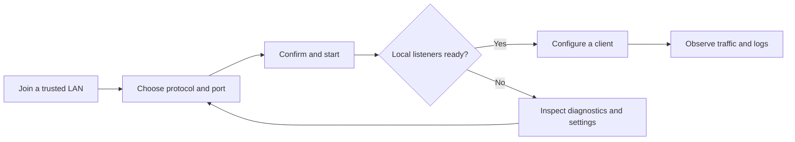

<div align="center">

# APS / SIGNAL

**Your mobile device. A native proxy. A clearer connection.**

HTTP · HTTPS CONNECT · SOCKS5 TCP  
Android · iOS / iPadOS

[](#download)
[](#download)
[](#experience)
[](LICENSE)

**English** · [简体中文](README.zh-CN.md)

[Download](#download) · [Experience](#experience) · [Features](#features) · [Platform support](#support) · [Architecture](#architecture) · [Quick start](#quick-start) · [Development](#development) · [Credits](#credits)

</div>

---

**APS turns an Android device, iPhone or iPad into a local HTTP / SOCKS5 proxy server.** Connect a proxy-aware browser, command-line tool or application on a trusted LAN, then inspect the session from a native interface: start and stop listeners, share connection details, follow live traffic and diagnose connection problems.

Originally derived from **Android Proxy Server**, APS now brings the **SIGNAL** experience to two independent native implementations: **Kotlin / Jetpack Compose** on Android and **Swift / SwiftUI** on iOS. It is a proxy server on your device—not a VPN subscription, remote node provider or WebView wrapper.

This `main` branch is the project landing page and Android source. The independent iOS application lives on the [`ios` branch](https://github.com/NingSo/APS/tree/ios).

<a id="download"></a>
## Download

| Platform | Published package | Requirements | Installation |
| --- | --- | --- | --- |
| **Android** | **[1.0.0 · Stable release](https://github.com/NingSo/APS/releases/tag/android-v1.0.0)** | Android 8.0+ / API 26+ | **[Download signed APK](https://github.com/NingSo/APS/releases/download/android-v1.0.0/APS-Android-1.0.0.apk)** |
| **iOS / iPadOS** | **[1.0.0 · Unsigned device build](https://github.com/NingSo/APS/releases/tag/ios-v1.0.0-preview.1)** | iOS / iPadOS 16.0+ | **[Download IPA · signing required](https://github.com/NingSo/APS/releases/download/ios-v1.0.0-preview.1/APS-iOS-1.0.0-unsigned.ipa)** |

> [!IMPORTANT]
> **The iOS IPA requires valid signing and provisioning before installation.** It is an arm64 iPhoneOS Release build, not a simulator archive, but downloading it in Safari does not install it. No TestFlight or App Store distribution is currently provided. See the [iOS installation and release guide](https://github.com/NingSo/APS/blob/ios/ios/RELEASES.md).

Android 1.0.0 is a non-debuggable Release build with package ID `com.ningso.aps`. It can coexist with the older `com.ningso.aps.debug` test app; settings do not migrate automatically. Do not run both copies on the same proxy ports.

Each release includes installation notes, build provenance and SHA-256 checksums. Choose the `.apk` or `.ipa` asset—not GitHub's automatically generated **Source code** archives. See [all releases](https://github.com/NingSo/APS/releases).

<a id="experience"></a>
## The SIGNAL experience

A near-black canvas, lime accents, native signal orbits and readable network values keep the next action clear. The interface follows three primary destinations—**Overview**, **Connect** and **Activity**—with **Settings** and **Diagnostics** available when needed.

| Overview · control the session | Connect · configure the client |
| :---: | :---: |
|  |  |

*SIGNAL design-reference images; addresses and metrics are illustrative, not live device data. The two native apps follow this visual language while retaining platform-specific controls, safe areas and sheet behavior.*

The signal orbit is drawn with **native Canvas APIs**, not an embedded animation movie or web page. Both implementations provide reduced-motion behavior; an animated ring is never used as a substitute for actual listener state.

<a id="features"></a>
## Features

| Capability | What you can do |
| --- | --- |
| **HTTP & SOCKS5 proxying** | Forward HTTP requests, tunnel HTTPS with HTTP `CONNECT`, and relay SOCKS5 TCP `CONNECT` traffic. Enable either protocol or both. |
| **Explicit session control** | Start and stop deliberately, review trusted-network consent, and distinguish standby, starting, running, stopping and failure states. Opening the app does not start a server. |
| **Connection setup, in one place** | View detected LAN IPv4 addresses, choose the client-facing address, copy host/port details, generate a configuration QR code and use native system sharing. |
| **Live session visibility** | Inspect receive/send rates, cumulative traffic, active connections and total connections. Rates are sampled each second, with up to 60 chart samples retained. |
| **Configuration & diagnostics** | Edit protocol ports with range/conflict validation, save preferences, inspect local listener status and follow platform-specific network/background guidance. |
| **Searchable session logs** | Search and filter up to 200 in-memory log entries and explicitly export them. Stop clears the in-memory session, while protocol preferences remain saved. |

Configuration changes made during a running session rebuild listeners and interrupt existing connections. The editor makes that interruption explicit. A successful local listener check is **not** a claim that a remote client or Internet destination is reachable.

<a id="support"></a>
## Platform support

| Area | Android | iOS / iPadOS |
| --- | --- | --- |
| Native interface | Jetpack Compose + Canvas | SwiftUI + Canvas |
| Networking engine | Netty-based upstream `proxycore` | Independent `Network.framework` implementation |
| HTTP forwarding / HTTPS via `CONNECT` | Supported | Supported |
| SOCKS5 TCP `CONNECT` | Supported | Supported |
| Client connection address | Detected LAN IPv4 address | Detected LAN IPv4 address; local-network access required |
| QR, copy, sharing, traffic, logs | Supported | Supported |
| Background / lock-screen use | Foreground service; subject to Android and vendor battery policies | **Foreground only**; backgrounding or locking stops the session |
| Screen-awake option | No dedicated screen-awake toggle | Optional while the app is foregrounded and the proxy is running |
| Network changes | Refreshes addresses and prompts for updated client configuration | Detected changes invalidate consent/sharing and stop the session |
| Default ports | HTTP `8080` · SOCKS5 `1080` | HTTP `8080` · SOCKS5 `1080` |
| Distributed package | Signed, non-debuggable APK | Unsigned device IPA; re-signing required |

**Client compatibility.** Windows, macOS, Linux, Android and iOS applications can connect when they support the selected proxy protocol and can reach the host device. Configuring a system proxy does not guarantee that every application uses it. Wi-Fi client isolation, firewalls, hotspot policies and VPN app exclusions can affect connectivity.

**Outside the current scope.** No SOCKS5 UDP/BIND, proxy authentication, built-in VPN tunnel, hotspot creation, automatic client configuration, connected-device inventory or cloud relay. QR codes contain configuration text; they do not silently modify a client's system settings. Connection counts are **TCP connections, not device counts**. IPv6-only client networks are not claimed as a supported connection setup.

<a id="architecture"></a>
## Architecture

**One product experience; two native implementations.** Clients connect to one host platform. User-interface controls manage that platform's listeners; proxy traffic follows the host operating system's routing to the destination.



Android preserves the upstream Kotlin proxy core; iOS does **not** execute that core or share the Android runtime. There is no APS cloud service between the host device and the destination.

### Interaction flow

The task flow is designed around **start → connect → observe**, with configuration and diagnostics available to resolve failures.



<a id="quick-start"></a>
## Quick start

1. **Connect to a trusted network.** The client must be able to reach the Android device, iPhone or iPad. Allow iOS local-network access when prompted.
2. **Choose and start.** Enable HTTP, SOCKS5 or both, confirm the ports, review the trust notice and start the proxy. Keep the iOS app in the foreground.
3. **Configure the client.** Use the address displayed in APS and the matching protocol port. Do not enter `0.0.0.0`; it is a bind address, not a client destination. Leave proxy authentication off.
4. **Verify an actual request.** Check the client response and the Activity screen. If it fails, inspect routing, client isolation, permissions, ports and logs rather than relying on the running indicator alone.

For a command-line client, replace the **documentation-only address** `192.0.2.10` with the address shown by your host device:

```sh
# HTTPS through the HTTP CONNECT proxy
curl --proxy http://192.0.2.10:8080 https://example.com

# SOCKS5 TCP; the proxy resolves the destination hostname
curl --proxy socks5h://192.0.2.10:1080 https://example.com
```

<a id="security"></a>
## Security & privacy

> [!WARNING]
> **Use APS only on a trusted LAN. The listeners are unauthenticated.** Do not expose their ports through public port forwarding or treat this app as an authenticated Internet proxy. Selecting a client-facing address is not an access-control rule.

APS has no app accounts, advertisements, built-in telemetry or automatic log uploads. Sessions are local, but **the traffic you explicitly proxy still reaches its intended network destinations**. Exported logs may contain network details and persist wherever you save or share them.

HTTPS `CONNECT` carries the client's TLS session; it does not turn every proxy connection into encrypted transport. Plain HTTP remains plain HTTP. APS neither provides anonymity nor overrides the host operating system's routing or VPN rules.

On iOS, stopping on background entry is an intentional lifecycle boundary, not a hidden keep-alive workaround. See Apple's [background execution guidance](https://developer.apple.com/forums/thread/685525) and [signed device distribution requirements](https://developer.apple.com/documentation/xcode/distributing-your-app-to-registered-devices).

<a id="development"></a>
## Development

### Repository layout

The platform branches are deliberately independent. Use separate working directories when developing both; do not merge the iOS-only directory layout wholesale into the Android branch.

| Branch | Role | Main paths |
| --- | --- | --- |
| [`main`](https://github.com/NingSo/APS/tree/main) | Project homepage, Android source and Android releases | `app/`, `proxycore/`, `gradle/`, `scripts/`, `docs/` |
| [`ios`](https://github.com/NingSo/APS/tree/ios) | iPhone/iPad source, native tests and IPA packaging | `ios/APS/`, `ios/Tests/`, `ios/UITests/`, `ios/Support/`, `ios/scripts/` |

<details>
<summary><strong>Build Android</strong> — JDK 21, Android SDK 36, Python 3.11+</summary>

Install Android SDK Platform 36 and Build Tools 36.0.0; set `ANDROID_HOME` or a local `sdk.dir`. Toolchain versions are pinned in [`gradle/libs.versions.toml`](gradle/libs.versions.toml) and the wrapper properties.

```sh
git clone --branch main --single-branch https://github.com/NingSo/APS.git APS-android
cd APS-android
python3 scripts/bootstrap_gradle.py
./gradlew :proxycore:testDebugUnitTest :app:testDebugUnitTest :app:lintDebug :app:assembleDebug
```

The bootstrap retrieves the pinned wrapper JAR and checks its Git blob hash. Dependency resolution requires network access. On Windows, use `python` and `gradlew.bat` with the same tasks.

The local debug APK is `app/build/outputs/apk/debug/app-debug.apk`; it is separate from the signed stable release. For production builds and continuity of the established signing certificate, follow the [Android release guide](docs/RELEASES.md). Do not generate a replacement key for an existing application identity.

</details>

<details>
<summary><strong>Build iOS / iPadOS</strong> — macOS, Xcode, Python 3 and XcodeGen</summary>

Use Xcode with a compatible installed iOS simulator and make `xcodegen` available on your path.

```sh
git clone --branch ios --single-branch https://github.com/NingSo/APS.git APS-ios
cd APS-ios
bash ios/bootstrap.sh
open ios/APS.xcodeproj

# Native compilation, local proxy tests and full-app UI tests
bash ios/scripts/ci.sh
```

The Xcode project and app icons are generated by the bootstrap. For a physical device, select your own development team and configure valid signing/provisioning in Xcode. No third-party application package dependencies are required. Packaging an IPA alone does not make it installable without signing.

See the [iOS source](https://github.com/NingSo/APS/tree/ios/ios) and [iOS release guide](https://github.com/NingSo/APS/blob/ios/ios/RELEASES.md).

</details>

### Verification & releases

[Android CI](https://github.com/NingSo/APS/actions/workflows/android.yml) covers source checks, the configured unit tests, Lint and debug packaging. The separate [Android release workflow](https://github.com/NingSo/APS/blob/main/.github/workflows/release-android.yml) validates the Release build, package/version, certificate and ZIP alignment before publication. [Android native UI checks](https://github.com/NingSo/APS/actions/workflows/native-ui.yml) are manually dispatched.

The [iOS workflow](https://github.com/NingSo/APS/blob/ios/.github/workflows/ios.yml) runs native compilation, unit/local-proxy integration tests and full-app UI tests; requested IPA publication is gated on those checks. Test results, screenshots and recordings are retained as Actions artifacts. Release pages identify the exact source revision and build run. A CI result is evidence for that run—not a blanket guarantee for every device, network or visual configuration.

### Contributing

Open an [issue](https://github.com/NingSo/APS/issues) with the platform, OS/app version, device model and reproducible steps. Target Android changes at `main` and iOS changes at `ios`, keep changes focused, and include relevant tests. Redact private network details before sharing logs. Never commit signing keys, passwords or provisioning material.

<a id="credits"></a>
## Credits & license

**Special thanks to [hect0x7](https://github.com/hect0x7) and [android-proxy-server](https://github.com/hect0x7/android-proxy-server)** for the Android proxy foundation. APS's Android app builds on that foundation with the SIGNAL interface and application orchestration. Its iOS app is implemented independently in Swift.

The **15 original Kotlin core files** remain pinned to upstream commit [`a785282`](https://github.com/hect0x7/android-proxy-server/commit/a785282cf172112590e992165090b4729d5f64dc). Their blob hashes are recorded in [`upstream-lock.json`](upstream-lock.json) and verified by [`scripts/check_source.py`](scripts/check_source.py).

We also acknowledge the **Android Open Source Project / Jetpack Compose**, **JetBrains / Kotlin**, **Kotlin Coroutines**, **Netty**, **SLF4J** and **ZXing** communities. The iOS implementation uses Apple's **SwiftUI**, **Network.framework** and **Core Image** platform frameworks; it is not a port of the Kotlin runtime.

APS source is available under the **[Apache License 2.0](LICENSE)**. The upstream **Copyright 2026 hect0x7** attribution and **[NOTICE](NOTICE)** are retained. Third-party components remain subject to their respective licenses and notices; the project license does not replace those terms. Please retain the applicable license and attribution notices when redistributing the project.

---

<div align="center">

**Less noise. More signal.**

[Android source](https://github.com/NingSo/APS/tree/main) · [iOS source](https://github.com/NingSo/APS/tree/ios) · [Releases](https://github.com/NingSo/APS/releases) · [Report an issue](https://github.com/NingSo/APS/issues)

</div>
