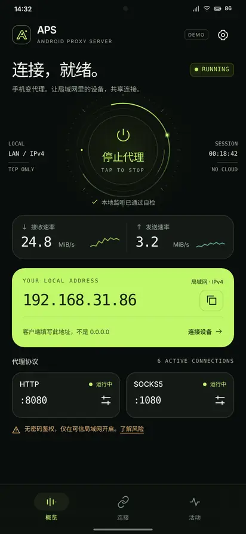
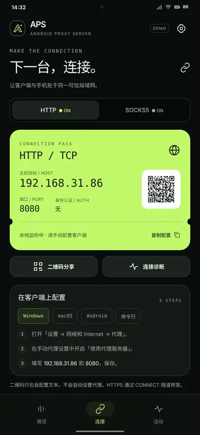
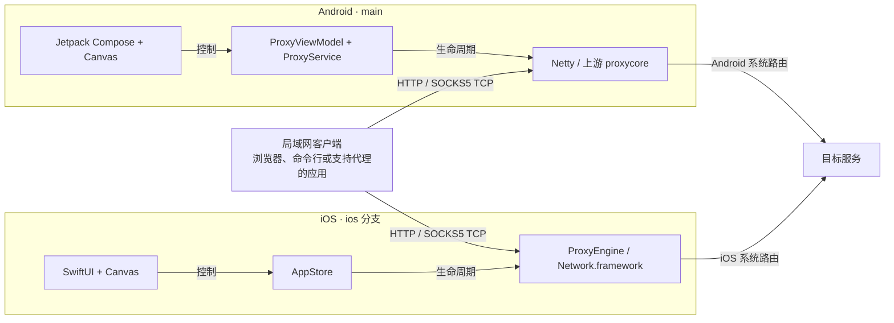
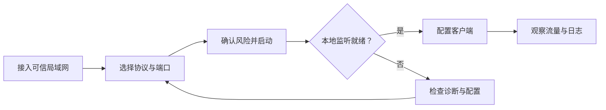

<div align="center">

# APS / SIGNAL

**让移动设备成为代理，让连接清晰可见。**

HTTP · HTTPS CONNECT · SOCKS5 TCP  
Android · iOS / iPadOS

[](#download)
[](#download)
[](#experience)
[](LICENSE)

[English](README.md) · **简体中文**

[下载安装](#download) · [界面体验](#experience) · [功能特性](#features) · [支持范围](#support) · [架构设计](#architecture) · [快速开始](#quick-start) · [开发指南](#development) · [致谢与版权](#credits)

</div>

---

**APS 可将 Android 设备、iPhone 或 iPad 变为本地 HTTP / SOCKS5 代理服务器。** 让可信局域网中支持代理的浏览器、命令行工具或应用通过设备转发请求，并在原生界面中完成启停、连接配置分享、流量观察和问题排查。

项目起源于 **Android Proxy Server**，现已将 **SIGNAL** 体验扩展至两套独立原生实现：Android 使用 **Kotlin / Jetpack Compose**，iOS 使用 **Swift / SwiftUI**。它是运行在设备上的代理服务器，不是 VPN 订阅服务、远程节点供应商或 WebView 套壳应用。

当前 `main` 分支承担项目首页与 Android 源码入口；独立 iOS 应用位于 [`ios` 分支](https://github.com/NingSo/APS/tree/ios)。

<a id="download"></a>
## 下载安装

| 平台 | 已发布版本 | 系统要求 | 安装入口 |
| --- | --- | --- | --- |
| **Android** | **[1.0.0 · 正式版](https://github.com/NingSo/APS/releases/tag/android-v1.0.0)** | Android 8.0+ / API 26+ | **[下载已签名 APK](https://github.com/NingSo/APS/releases/download/android-v1.0.0/APS-Android-1.0.0.apk)** |
| **iOS / iPadOS** | **[1.0.0 · 未签名真机构建](https://github.com/NingSo/APS/releases/tag/ios-v1.0.0-preview.1)** | iOS / iPadOS 16.0+ | **[下载 IPA · 需要重签](https://github.com/NingSo/APS/releases/download/ios-v1.0.0-preview.1/APS-iOS-1.0.0-unsigned.ipa)** |

> [!IMPORTANT]
> **iOS IPA 需要有效签名和描述文件才能安装。** 该附件是使用 iPhoneOS SDK 编译的 arm64 Release 真机应用，不是模拟器压缩包，但无法通过 Safari 下载后直接安装。目前未提供 TestFlight 或 App Store 分发。具体见 [iOS 安装与发布指南](https://github.com/NingSo/APS/blob/ios/ios/RELEASES.zh-CN.md)。

Android 1.0.0 是不可调试的 Release 构建，正式包名为 `com.ningso.aps`。它可与旧版 `com.ningso.aps.debug` 测试应用并存，但不会自动迁移设置；请勿同时启动两份应用占用相同代理端口。

每个 Release 均提供安装说明、构建来源和 SHA-256 校验文件。请选择 `.apk` 或 `.ipa` 附件，不要将 GitHub 自动生成的 **Source code** 源码压缩包当作安装包。[查看全部版本](https://github.com/NingSo/APS/releases)。

<a id="experience"></a>
## SIGNAL 界面体验

近黑底色、荧光绿强调色、原生信号环与清晰的网络数值，让每一步操作都有明确入口。界面围绕 **概览、连接、活动** 三个主要页面展开，并提供 **设置、诊断** 两个辅助页面。

| 概览 · 掌控当前会话 | 连接 · 配置客户端 |
| :---: | :---: |
|  |  |

*以上为 SIGNAL 设计参考图，地址与指标为示意数据，并非实时设备数据。双端原生应用沿用这一视觉语言，同时保留各自平台的控件、安全区域与弹层交互。*

首页信号环由 **原生 Canvas API** 绘制，并非嵌入视频或网页动画。双端均提供减少动态效果的处理；旋转动画不替代真实监听状态，也不模拟连接成功。

<a id="features"></a>
## 功能特性 · Features

| 能力 | 具体功能 |
| --- | --- |
| **HTTP 与 SOCKS5 代理** | 转发 HTTP 请求，通过 HTTP `CONNECT` 隧道承载 HTTPS，并支持 SOCKS5 TCP `CONNECT`。可单独或同时启用两种协议。 |
| **明确的会话控制** | 手动启停、可信网络确认，以及待机、启动中、运行中、停止中、失败等状态展示。打开应用不会自动启动代理。 |
| **集中式连接配置** | 展示检测到的局域网 IPv4 地址，选择客户端连接地址，复制地址与端口，生成配置二维码，并通过系统原生分享功能发送配置。 |
| **实时会话观察** | 查看接收／发送速率、累计流量、活动连接与累计连接。每秒采样速率，图表最多保留 60 个采样点。 |
| **配置与诊断** | 编辑协议端口、校验范围及冲突、保存偏好、查看本地监听状态，并提供对应平台的网络与后台运行指引。 |
| **可检索会话日志** | 搜索、筛选最多 200 条内存日志，并由用户主动导出。停止后清空内存会话，保留协议配置偏好。 |

运行中修改代理配置会重建监听并中断已有连接，编辑界面会明确提示影响。**本地监听检查通过，不代表远端客户端或互联网目标一定可达。**

<a id="support"></a>
## 平台与支持范围

| 项目 | Android | iOS / iPadOS |
| --- | --- | --- |
| 原生界面 | Jetpack Compose + Canvas | SwiftUI + Canvas |
| 网络引擎 | 基于 Netty 的上游 `proxycore` | 独立 `Network.framework` 实现 |
| HTTP 转发／HTTPS `CONNECT` | 支持 | 支持 |
| SOCKS5 TCP `CONNECT` | 支持 | 支持 |
| 客户端连接地址 | 检测到的局域网 IPv4 地址 | 检测到的局域网 IPv4 地址；需要局域网访问权限 |
| 二维码、复制、分享、流量、日志 | 支持 | 支持 |
| 后台／锁屏运行 | 使用前台服务；受 Android 与厂商电池策略影响 | **仅前台运行**；进入后台或锁屏后停止 |
| 保持屏幕唤醒 | 无独立常亮开关 | 可选，仅在前台且代理运行时生效 |
| 网络变化处理 | 刷新地址，提示更新客户端配置 | 检测到变化后使确认／分享失效，并停止会话 |
| 默认端口 | HTTP `8080` · SOCKS5 `1080` | HTTP `8080` · SOCKS5 `1080` |
| 发布产物 | 已签名、不可调试 APK | 未签名真机 IPA；需要重签 |

**客户端兼容性。** Windows、macOS、Linux、Android、iOS 上支持相应代理协议的应用，在能够访问宿主设备时均可作为客户端。设置系统代理不意味着所有应用都会使用代理。Wi-Fi 客户端隔离、防火墙、热点策略以及 VPN 的应用排除规则都可能影响连通性。

**当前不包含。** SOCKS5 UDP／BIND、代理鉴权、内置 VPN 隧道、创建热点、自动配置客户端、已连接设备身份识别以及云端中继。二维码承载配置文本，不会静默修改客户端系统设置。连接数是 **TCP 连接数，不是设备数**。当前不将纯 IPv6 客户端网络列为已支持的连接方式。

<a id="architecture"></a>
## 架构设计

**统一产品体验，两套原生实现。** 客户端选择一个宿主平台接入；界面控制该平台的监听服务，代理流量遵循宿主操作系统路由到达目标服务。



Android 保留上游 Kotlin 代理内核；iOS **不运行该内核，也不共享 Android 运行时**。宿主设备与目标服务之间没有 APS 云端中转服务。

### 交互流程

核心任务按 **启动 → 连接 → 观察** 展开，通过配置和诊断处理异常，而不是让所有设置挤在首页。



<a id="quick-start"></a>
## 快速开始

1. **连接可信网络。** 确保客户端能够访问作为宿主的 Android 设备、iPhone 或 iPad；iOS 提示时请允许局域网访问。
2. **选择协议并启动。** 启用 HTTP、SOCKS5 或两者，确认端口，阅读可信网络提示后启动。iOS 应用需要保持前台。
3. **填写客户端配置。** 使用 APS 展示的地址和对应协议端口。不要填写 `0.0.0.0`，它是监听绑定地址，不是客户端目标地址；客户端无需开启代理鉴权。
4. **发起实际请求验证。** 同时检查客户端响应和活动页。失败时检查路由、客户端隔离、权限、端口及日志，不要仅依据“运行中”判断连通性。

命令行示例中的 `192.0.2.10` 是 **文档保留示例地址**，请替换为宿主设备上实际显示的地址：

```sh
# 通过 HTTP CONNECT 代理访问 HTTPS
curl --proxy http://192.0.2.10:8080 https://example.com

# SOCKS5 TCP，由代理解析目标域名
curl --proxy socks5h://192.0.2.10:1080 https://example.com
```

<a id="security"></a>
## 安全与隐私

> [!WARNING]
> **仅在可信局域网使用，监听服务没有鉴权。** 不要将端口映射到公网，也不要将本应用作为有身份认证的互联网代理服务。选择客户端连接地址不等于设置访问控制规则。

APS 不包含应用账号、广告、内置遥测或自动日志上传。会话在本地处理，但 **你主动通过代理发出的流量仍会访问其目标网络服务**。导出的日志可能包含网络细节，并会保留在你选择的保存或分享位置。

HTTPS `CONNECT` 承载客户端原有的 TLS 会话，不代表所有代理连接都被加密；普通 HTTP 仍是明文 HTTP。APS 不提供匿名性保证，也不会覆盖操作系统路由或 VPN 规则。

iOS 进入后台时停止代理是明确的生命周期边界，不使用隐蔽保活方案。可参考 Apple 的 [后台执行说明](https://developer.apple.com/forums/thread/685525) 和 [设备签名分发要求](https://developer.apple.com/documentation/xcode/distributing-your-app-to-registered-devices)。

<a id="development"></a>
## 开发指南

### 分支与目录

双端分支刻意保持独立。并行开发建议使用两个工作目录，不要将仅包含 iOS 的目录结构整体合并覆盖 Android 分支。

| 分支 | 职责 | 主要目录 |
| --- | --- | --- |
| [`main`](https://github.com/NingSo/APS/tree/main) | 项目首页、Android 源码与 Android 发布 | `app/`、`proxycore/`、`gradle/`、`scripts/`、`docs/` |
| [`ios`](https://github.com/NingSo/APS/tree/ios) | iPhone／iPad 源码、原生测试与 IPA 打包 | `ios/APS/`、`ios/Tests/`、`ios/UITests/`、`ios/Support/`、`ios/scripts/` |

<details>
<summary><strong>构建 Android</strong> — JDK 21、Android SDK 36、Python 3.11+</summary>

安装 Android SDK Platform 36 与 Build Tools 36.0.0，设置 `ANDROID_HOME` 或本地 `sdk.dir`。工具链版本固定在 [`gradle/libs.versions.toml`](gradle/libs.versions.toml) 与 wrapper 配置中。

```sh
git clone --branch main --single-branch https://github.com/NingSo/APS.git APS-android
cd APS-android
python3 scripts/bootstrap_gradle.py
./gradlew :proxycore:testDebugUnitTest :app:testDebugUnitTest :app:lintDebug :app:assembleDebug
```

引导脚本会获取固定版本的 wrapper JAR 并校验 Git blob 哈希；依赖解析需要网络。在 Windows 上使用 `python` 和 `gradlew.bat` 执行相同任务。

本地 Debug 产物位于 `app/build/outputs/apk/debug/app-debug.apk`，与已签名正式版不同。生产构建及固定发布证书的维护方式见 [Android 发布指南](docs/RELEASES.zh-CN.md)。不要为已有应用身份重新生成替代签名密钥。

</details>

<details>
<summary><strong>构建 iOS / iPadOS</strong> — macOS、Xcode、Python 3 与 XcodeGen</summary>

准备 Xcode、与其兼容的 iOS 模拟器，并确保命令行可执行 `xcodegen`。

```sh
git clone --branch ios --single-branch https://github.com/NingSo/APS.git APS-ios
cd APS-ios
bash ios/bootstrap.sh
open ios/APS.xcodeproj

# 原生编译、本地代理测试与完整应用 UI 测试
bash ios/scripts/ci.sh
```

引导脚本会生成 Xcode 工程和应用图标。使用真机时，在 Xcode 中选择自己的开发团队并配置有效签名及描述文件。应用不依赖第三方应用层包；仅完成 IPA 打包并不能免除签名安装条件。

参见 [iOS 源码目录](https://github.com/NingSo/APS/tree/ios/ios) 与 [iOS 发布指南](https://github.com/NingSo/APS/blob/ios/ios/RELEASES.zh-CN.md)。

</details>

### 验证与发布

[Android CI](https://github.com/NingSo/APS/actions/workflows/android.yml) 执行源码检查、已配置的单元测试、Lint 和 Debug 打包；独立 [Android 发布工作流](https://github.com/NingSo/APS/blob/main/.github/workflows/release-android.yml) 在发布前验证 Release 构建、包名／版本、证书与 ZIP 对齐。[Android 原生 UI 检查](https://github.com/NingSo/APS/actions/workflows/native-ui.yml) 通过手动触发运行。

[iOS 工作流](https://github.com/NingSo/APS/blob/ios/.github/workflows/ios.yml) 执行原生编译、单元／本地代理集成测试及完整应用 UI 测试；请求发布 IPA 时须先通过这些检查。测试结果、截图与录屏保留在 Actions 产物中，Release 页面记录对应源码版本和构建运行。CI 结果代表该次运行的验证证据，不代表所有设备、网络或视觉配置均已验收。

### 参与贡献

欢迎通过 [Issues](https://github.com/NingSo/APS/issues) 提供平台、系统／应用版本、设备型号和可复现步骤。Android 修改提交到 `main`，iOS 修改提交到 `ios`，保持改动聚焦并补充对应测试。分享日志前请脱敏私有网络信息；不要提交签名密钥、密码或描述文件。

<a id="credits"></a>
## 致谢、许可证与版权

**特别感谢 [hect0x7](https://github.com/hect0x7) 及其 [android-proxy-server](https://github.com/hect0x7/android-proxy-server) 项目**，为 Android 代理能力提供基础。APS 的 Android 端基于这一网络基础构建 SIGNAL 界面与应用层调度；iOS 端采用独立 Swift 实现。

Android 的 **15 个原始 Kotlin 内核文件** 保持固定在上游提交 [`a785282`](https://github.com/hect0x7/android-proxy-server/commit/a785282cf172112590e992165090b4729d5f64dc)，文件 blob 哈希记录于 [`upstream-lock.json`](upstream-lock.json)，由 [`scripts/check_source.py`](scripts/check_source.py) 校验。

同时感谢 **Android Open Source Project / Jetpack Compose**、**JetBrains / Kotlin**、**Kotlin Coroutines**、**Netty**、**SLF4J** 与 **ZXing** 社区。iOS 使用 Apple 的 **SwiftUI**、**Network.framework** 和 **Core Image** 平台框架，并非 Kotlin 运行时移植。

APS 源码采用 **[Apache License 2.0](LICENSE)**，保留上游 **Copyright 2026 hect0x7** 署名及 **[NOTICE](NOTICE)**。第三方组件仍适用各自的许可证和声明，项目许可证不会替代这些条款。再分发时请保留适用的许可证及归属声明。

---

<div align="center">

**Less noise. More signal.**

[Android 源码](https://github.com/NingSo/APS/tree/main) · [iOS 源码](https://github.com/NingSo/APS/tree/ios) · [版本发布](https://github.com/NingSo/APS/releases) · [问题反馈](https://github.com/NingSo/APS/issues)

</div>
