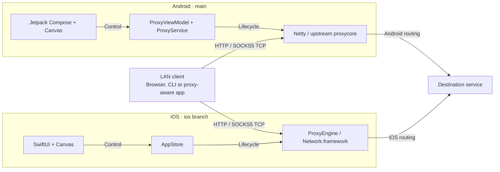
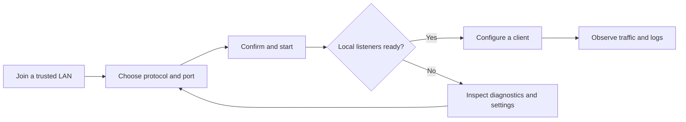

# Architecture, behavior & development

[Project homepage](../README.md) · [简体中文](TECHNICAL.zh-CN.md)

<a id="architecture"></a>
## Architecture

**One product experience; two native implementations.** Clients connect to one host platform. User-interface controls manage that platform's listeners; proxy traffic follows the host operating system's routing to the destination.



Android preserves the upstream Kotlin proxy core; iOS does **not** execute that core or share the Android runtime. There is no APS cloud service between the host device and the destination.

### Interaction flow

The task flow is designed around **start → connect → observe**, with configuration and diagnostics available to resolve failures.



<a id="security"></a>
## Security & privacy

> [!WARNING]
> **Use APS only on a trusted LAN. The listeners are unauthenticated.** Do not expose their ports through public port forwarding or treat this app as an authenticated Internet proxy. Selecting a client-facing address is not an access-control rule.

APS has no app accounts, advertisements, built-in telemetry or automatic log uploads. Sessions are local, but **the traffic you explicitly proxy still reaches its intended network destinations**. Exported logs may contain network details and persist wherever you save or share them.

HTTPS `CONNECT` carries the client's TLS session; it does not turn every proxy connection into encrypted transport. Plain HTTP remains plain HTTP. APS neither provides anonymity nor overrides the host operating system's routing or VPN rules.

On iOS, stopping on background entry is an intentional lifecycle boundary, not a hidden keep-alive workaround. See Apple's [background execution guidance](https://developer.apple.com/forums/thread/685525) and [signed device distribution requirements](https://developer.apple.com/documentation/xcode/distributing-your-app-to-registered-devices).

<a id="development"></a>
## Development

### Repository layout

The platform branches are deliberately independent. Use separate working directories when developing both; do not merge the iOS-only directory layout wholesale into the Android branch.

| Branch | Role | Main paths |
| --- | --- | --- |
| [`main`](https://github.com/NingSo/APS/tree/main) | Project homepage, Android source and Android releases | `app/`, `proxycore/`, `gradle/`, `scripts/`, `docs/` |
| [`ios`](https://github.com/NingSo/APS/tree/ios) | iPhone/iPad source, native tests and IPA packaging | `ios/APS/`, `ios/Tests/`, `ios/UITests/`, `ios/Support/`, `ios/scripts/` |

<details>
<summary><strong>Build Android</strong> — JDK 21, Android SDK 36, Python 3.11+</summary>

Install Android SDK Platform 36 and Build Tools 36.0.0; set `ANDROID_HOME` or a local `sdk.dir`. Toolchain versions are pinned in [`gradle/libs.versions.toml`](../gradle/libs.versions.toml) and the wrapper properties.

```sh
git clone --branch main --single-branch https://github.com/NingSo/APS.git APS-android
cd APS-android
python3 scripts/bootstrap_gradle.py
./gradlew :proxycore:testDebugUnitTest :app:testDebugUnitTest :app:lintDebug :app:assembleDebug
```

The bootstrap retrieves the pinned wrapper JAR and checks its Git blob hash. Dependency resolution requires network access. On Windows, use `python` and `gradlew.bat` with the same tasks.

The local debug APK is `app/build/outputs/apk/debug/app-debug.apk`; it is separate from the signed stable release. For production builds and continuity of the established signing certificate, follow the [Android release guide](../docs/RELEASES.md). Do not generate a replacement key for an existing application identity.

</details>

<details>
<summary><strong>Build iOS / iPadOS</strong> — macOS, Xcode, Python 3 and XcodeGen</summary>

Use Xcode with a compatible installed iOS simulator and make `xcodegen` available on your path.

```sh
git clone --branch ios --single-branch https://github.com/NingSo/APS.git APS-ios
cd APS-ios
bash ios/bootstrap.sh
open ios/APS.xcodeproj

# Native compilation, local proxy tests and full-app UI tests
bash ios/scripts/ci.sh
```

The Xcode project and app icons are generated by the bootstrap. For a physical device, select your own development team and configure valid signing/provisioning in Xcode. No third-party application package dependencies are required. Packaging an IPA alone does not make it installable without signing.

See the [iOS source](https://github.com/NingSo/APS/tree/ios/ios) and [iOS release guide](https://github.com/NingSo/APS/blob/ios/ios/RELEASES.md).

</details>

### Verification & releases

[Android CI](https://github.com/NingSo/APS/actions/workflows/android.yml) covers source checks, the configured unit tests, Lint and debug packaging. The separate [Android release workflow](https://github.com/NingSo/APS/blob/main/.github/workflows/release-android.yml) validates the Release build, package/version, certificate and ZIP alignment before publication. [Android native UI checks](https://github.com/NingSo/APS/actions/workflows/native-ui.yml) are manually dispatched.

The [iOS workflow](https://github.com/NingSo/APS/blob/ios/.github/workflows/ios.yml) runs native compilation, unit/local-proxy integration tests and full-app UI tests; requested IPA publication is gated on those checks. Test results, screenshots and recordings are retained as Actions artifacts. Release pages identify the exact source revision and build run. A CI result is evidence for that run—not a blanket guarantee for every device, network or visual configuration.

### Contributing

Open an [issue](https://github.com/NingSo/APS/issues) with the platform, OS/app version, device model and reproducible steps. Target Android changes at `main` and iOS changes at `ios`, keep changes focused, and include relevant tests. Redact private network details before sharing logs. Never commit signing keys, passwords or provisioning material.

