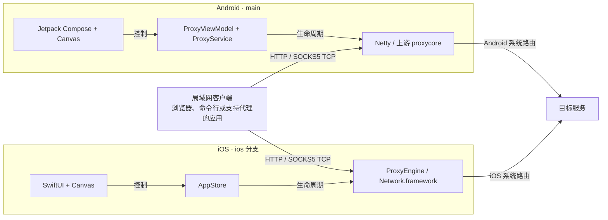
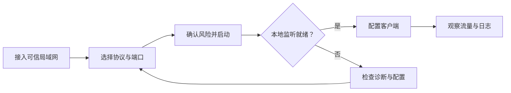

# 架构、运行机制与开发

[项目首页](../README.zh-CN.md) · [English](TECHNICAL.md)

<a id="architecture"></a>
## 架构设计

**统一产品体验，两套原生实现。** 客户端选择一个宿主平台接入；界面控制该平台的监听服务，代理流量遵循宿主操作系统路由到达目标服务。



Android 保留上游 Kotlin 代理内核；iOS **不运行该内核，也不共享 Android 运行时**。宿主设备与目标服务之间没有 APS 云端中转服务。

### 交互流程

核心任务按 **启动 → 连接 → 观察** 展开，通过配置和诊断处理异常，而不是让所有设置挤在首页。



<a id="security"></a>
## 安全与隐私

> [!WARNING]
> **仅在可信局域网使用，监听服务没有鉴权。** 不要将端口映射到公网，也不要将本应用作为有身份认证的互联网代理服务。选择客户端连接地址不等于设置访问控制规则。

APS 不包含应用账号、广告、内置遥测或自动日志上传。会话在本地处理，但 **你主动通过代理发出的流量仍会访问其目标网络服务**。导出的日志可能包含网络细节，并会保留在你选择的保存或分享位置。

HTTPS `CONNECT` 承载客户端原有的 TLS 会话，不代表所有代理连接都被加密；普通 HTTP 仍是明文 HTTP。APS 不提供匿名性保证，也不会覆盖操作系统路由或 VPN 规则。

iOS 进入后台时停止代理是明确的生命周期边界，不使用隐蔽保活方案。可参考 Apple 的 [后台执行说明](https://developer.apple.com/forums/thread/685525) 和 [设备签名分发要求](https://developer.apple.com/documentation/xcode/distributing-your-app-to-registered-devices)。

<a id="development"></a>
## 开发指南

### 分支与目录

双端分支刻意保持独立。并行开发建议使用两个工作目录，不要将仅包含 iOS 的目录结构整体合并覆盖 Android 分支。

| 分支 | 职责 | 主要目录 |
| --- | --- | --- |
| [`main`](https://github.com/NingSo/APS/tree/main) | 项目首页、Android 源码与 Android 发布 | `app/`、`proxycore/`、`gradle/`、`scripts/`、`docs/` |
| [`ios`](https://github.com/NingSo/APS/tree/ios) | iPhone／iPad 源码、原生测试与 IPA 打包 | `ios/APS/`、`ios/Tests/`、`ios/UITests/`、`ios/Support/`、`ios/scripts/` |

<details>
<summary><strong>构建 Android</strong> — JDK 21、Android SDK 36、Python 3.11+</summary>

安装 Android SDK Platform 36 与 Build Tools 36.0.0，设置 `ANDROID_HOME` 或本地 `sdk.dir`。工具链版本固定在 [`gradle/libs.versions.toml`](../gradle/libs.versions.toml) 与 wrapper 配置中。

```sh
git clone --branch main --single-branch https://github.com/NingSo/APS.git APS-android
cd APS-android
python3 scripts/bootstrap_gradle.py
./gradlew :proxycore:testDebugUnitTest :app:testDebugUnitTest :app:lintDebug :app:assembleDebug
```

引导脚本会获取固定版本的 wrapper JAR 并校验 Git blob 哈希；依赖解析需要网络。在 Windows 上使用 `python` 和 `gradlew.bat` 执行相同任务。

本地 Debug 产物位于 `app/build/outputs/apk/debug/app-debug.apk`，与已签名正式版不同。生产构建及固定发布证书的维护方式见 [Android 发布指南](../docs/RELEASES.zh-CN.md)。不要为已有应用身份重新生成替代签名密钥。

</details>

<details>
<summary><strong>构建 iOS / iPadOS</strong> — macOS、Xcode、Python 3 与 XcodeGen</summary>

准备 Xcode、与其兼容的 iOS 模拟器，并确保命令行可执行 `xcodegen`。

```sh
git clone --branch ios --single-branch https://github.com/NingSo/APS.git APS-ios
cd APS-ios
bash ios/bootstrap.sh
open ios/APS.xcodeproj

# 原生编译、本地代理测试与完整应用 UI 测试
bash ios/scripts/ci.sh
```

引导脚本会生成 Xcode 工程和应用图标。使用真机时，在 Xcode 中选择自己的开发团队并配置有效签名及描述文件。应用不依赖第三方应用层包；仅完成 IPA 打包并不能免除签名安装条件。

参见 [iOS 源码目录](https://github.com/NingSo/APS/tree/ios/ios) 与 [iOS 发布指南](https://github.com/NingSo/APS/blob/ios/ios/RELEASES.zh-CN.md)。

</details>

### 验证与发布

[Android CI](https://github.com/NingSo/APS/actions/workflows/android.yml) 执行源码检查、已配置的单元测试、Lint 和 Debug 打包；独立 [Android 发布工作流](https://github.com/NingSo/APS/blob/main/.github/workflows/release-android.yml) 在发布前验证 Release 构建、包名／版本、证书与 ZIP 对齐。[Android 原生 UI 检查](https://github.com/NingSo/APS/actions/workflows/native-ui.yml) 通过手动触发运行。

[iOS 工作流](https://github.com/NingSo/APS/blob/ios/.github/workflows/ios.yml) 执行原生编译、单元／本地代理集成测试及完整应用 UI 测试；请求发布 IPA 时须先通过这些检查。测试结果、截图与录屏保留在 Actions 产物中，Release 页面记录对应源码版本和构建运行。CI 结果代表该次运行的验证证据，不代表所有设备、网络或视觉配置均已验收。

### 参与贡献

欢迎通过 [Issues](https://github.com/NingSo/APS/issues) 提供平台、系统／应用版本、设备型号和可复现步骤。Android 修改提交到 `main`，iOS 修改提交到 `ios`，保持改动聚焦并补充对应测试。分享日志前请脱敏私有网络信息；不要提交签名密钥、密码或描述文件。

